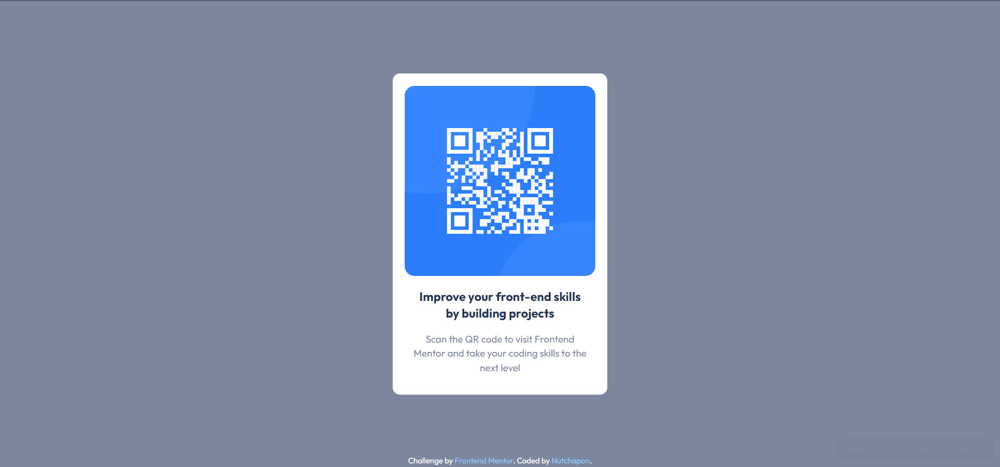

# Frontend Mentor - QR code component solution

This is a solution to the [QR code component challenge on Frontend Mentor With Tailwind](https://www.frontendmentor.io/challenges/qr-code-component-iux_sIO_H). Frontend Mentor challenges help you improve your coding skills by building realistic projects.

## Table of contents

- [Overview](#overview)
  - [Screenshot](#screenshot)
  - [Links](#links)
- [My process](#my-process)
  - [Built with](#built-with)
  - [What I learned](#what-i-learned)
  - [Useful resources](#useful-resources)
- [Author](#author)
- [Acknowledgments](#acknowledgments)

## Overview

### Screenshot

### Links

- Solution URL: [Add solution URL here](https://your-solution-url.com)
- Live Site URL: [Add live site URL here](https://your-live-site-url.com)

## My process

### Built with

- Semantic HTML5 markup
- CSS custom properties
- Flexbox
- [React](https://reactjs.org/) - JS library
- [TailwindCSS](https://tailwindcss.com/) - CSS framework

**Note: These are just examples. Delete this note and replace the list above with your own choices**

### What I learned

This is my second Tailwind project , IMO it easier than [first one of my Tailwind project](https://github.com/kodaicoder/faq-accordion-card) then not things I have learn so much from this project.

### Useful resources

- [Tailwind Documents](https://tailwindcss.com/docs/) - yah just a documents for telling me how to using Tailwind CSS.

## Author

- Github - [Nutchapon](https://github.com/kodaicoder)
- Twitter - [@SolanianNut](https://twitter.com/SolanianNut)
- Frontend Mentor - [@NutchaponMake](https://www.frontendmentor.io/profile/NutchaponMake)
